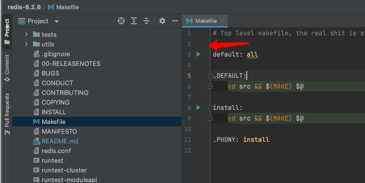

### 本地开发

    % make
    % make test
    #运行完之后，应该可以看到:
    \o/ All tests passed without errors!

运行

     % cd src
     % ./redis-server

### Clion开发

1、初始化时，点击Makefile中绿色小箭头，构建依赖，也可以使用上面的make命令。

2、配置运行环境

**启动之后**

### 开发小技巧

容量预估： http://www.redis.cn/redis_memory/

### docker image

https://github.com/docker-library/redis/blob/a04a6df0a45894e1a630db4e84e0c12c7bcf326a/6.2/Dockerfile
